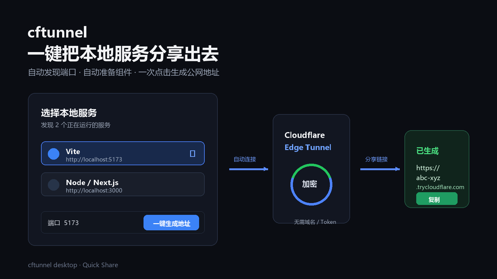

# cftunnel-app

[](https://github.com/qingchencloud/cftunnel-app/releases)
[](LICENSE)

**cftunnel 桌面客户端** — 基于 [Wails](https://wails.io) 构建的跨平台 GUI。

[English](README.en.md)

[cftunnel CLI](https://github.com/qingchencloud/cftunnel) 的可视化管理界面，让 Cloudflare Tunnel 内网穿透操作更直观。打开客户端后，首页会自动发现本机常见开发端口，选择服务并点击一次即可生成临时公网地址。

## 功能

- **仪表盘** — 隧道状态一目了然，一键启停
- **一键分享** — 自动发现本地服务，自动准备 cloudflared，无需域名、Token 或手动配置
- **免域名模式** — 选择端口即可生成 `*.trycloudflare.com` 临时公网地址
- **模式开关** — 设置页可开启固定域名模式；账号配置按需填写，一键模式不受影响
- **路由管理** — 可视化添加/删除路由，自动创建 DNS 记录
- **中继面板** — Relay 模式服务器配置、启停控制、系统服务注册
- **规则管理** — 可视化添加/删除中继穿透规则，支持 TCP/UDP/HTTP
- **链路检测** — 一键检测服务器连通性、本地服务、远程穿透端口状态和延迟
- **中继日志** — 实时查看 frpc 运行日志
- **服务端部署** — SSH 远程一键部署 frps 服务端
- **内置终端** — 直接执行 cftunnel 子命令，快捷命令 + 命令参考
- **关于页面** — 项目信息、关联项目、联系方式、客户端与 CLI 更新中心
- **外部链接** — 点击链接自动用系统浏览器打开

## 截图




## 下载安装

从 [GitHub Releases](https://github.com/qingchencloud/cftunnel-app/releases) 下载对应平台的安装包：

| 平台 | 文件 |
|------|------|
| macOS | `cftunnel-app-macos.zip` |
| Windows | `cftunnel-app-windows.zip` |
| Linux | `cftunnel-app-linux.tar.gz` |

## 使用方式

### 首页一键分享（推荐）

安装并打开客户端后：

1. 客户端自动检测 `3000`、`5173`、`8080` 等常见本地服务端口
2. 选择要分享的服务
3. 点击「一键生成地址」
4. 复制或打开生成的 `*.trycloudflare.com` 地址

首页模式会自动下载并缓存 Cloudflare 官方 `cloudflared`，不要求先配置域名、API Token 或账户 ID。

### 账号与配置开关

客户端默认保持轻量的一键模式。需要固定域名时，在「高级功能 → 设置」中打开「固定域名模式」，填写 Cloudflare `Account ID` 和 `API Token` 后保存；网页登录密码不会被客户端保存。中继服务器 Token、SSH 密钥或密码仍只在对应的中继页面按需配置。

### 更新中心

「高级功能 → 关于我们」内置更新中心，启动时会自动检查桌面客户端和 `cftunnel` 终端主体程序。终端程序支持一键更新，客户端会打开对应 Release 下载页；检查开关可在「高级功能 → 设置」中关闭。

### 高级管理

固定域名、路由管理、中继 TCP/UDP、服务端部署和终端等功能仍使用 [cftunnel CLI](https://github.com/qingchencloud/cftunnel)。首次进入高级功能时安装 CLI：

```bash
# macOS / Linux
curl -fsSL https://raw.githubusercontent.com/qingchencloud/cftunnel/main/install.sh | bash

# Windows (PowerShell)
irm https://raw.githubusercontent.com/qingchencloud/cftunnel/main/install.ps1 | iex
```

## 架构

```
┌─────────────────────────────────┐
│  React + TypeScript (前端 UI)    │
├─────────────────────────────────┤
│  Wails v2 (Go ↔ JS 桥接)       │
├─────────────────────────────────┤
│  Go 后端 (exec 调用 cftunnel)   │
├─────────────────────────────────┤
│  cftunnel CLI (本机已安装)       │
└─────────────────────────────────┘
```

桌面客户端通过 `exec` 调用本机 cftunnel CLI，完全独立不耦合。

## 开发

```bash
# 安装 Wails CLI
go install github.com/wailsapp/wails/v2/cmd/wails@latest

# 检查环境
wails doctor

# 开发模式（热重载）
wails dev

# 构建
wails build

# 运行测试
go test -v ./...
```

## 构建产物

| 平台 | 产物 | 大小 |
|------|------|------|
| macOS | `build/bin/cftunnel-app.app` | ~8MB |
| Windows | `build/bin/cftunnel-app.exe` | ~8MB |
| Linux | `build/bin/cftunnel-app` | ~8MB |

## 技术栈

- **后端**: Go + Wails v2
- **前端**: React + TypeScript + Vite
- **图标**: 内联 SVG (Lucide 风格，零依赖)
- **CI**: GitHub Actions 三平台自动构建

## 关联项目

- [cftunnel](https://github.com/qingchencloud/cftunnel) — CLI 工具（本客户端的核心依赖）
- [cftunnel 官网](https://cftunnel.qt.cool) — 产品介绍与下载
- [社区讨论](https://linux.do/t/1636467) — Linux.do 讨论帖
- [QQ 交流群](https://qm.qq.com/q/qUfdR0jJVS) — OpenClaw 交流群
- [Telegram 群](https://t.me/+-53et5QXFh0xYzhk) — cftunnel 社区

## License

MIT

---

由 [武汉晴辰天下网络科技有限公司](https://qingchencloud.com) 开源维护
